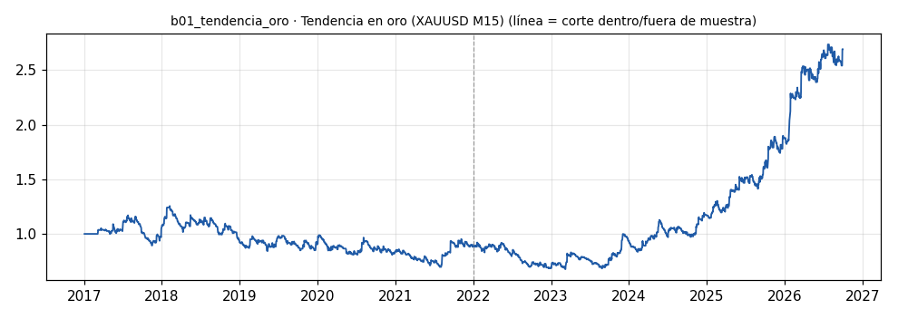

# b01_tendencia_oro · Tendencia en oro (XAUUSD M15)

> **Veredicto v1: PROMETEDOR, NO VALIDADO** — prototipo de investigación, no es una recomendación ni un sistema para dinero real.

**Concepto.** Seguir la dirección del oro y dejar correr la ganancia con trailing stop. Acierta 20-35 % de las veces; las ganadoras pagan a las perdedoras.

**Regla v1.** Largo si el cierre M15 rompe el máximo de las últimas 96 velas (un día) con la EMA de 800 velas (~8 días) subiendo; corto al revés. Stop inicial 2 ATR(14), trailing 3 ATR. Riesgo 1 % por operación.

**Para quién.** Latinoamérica con CFD desde 1.300-1.500 USD (Monte Carlo de la sesión 20: por debajo, el lote mínimo 0,01 sube el riesgo real por encima del plan). EE. UU. con microfuturos de oro (MGC) desde ~10.000 USD.

**Datos e instrumento.** MT5 Exness XAUUSD M15 (velas BID + spread real desde 2024-04-16) · Periodo 2017-01-03 → 2026-09-29

**Potencial (según la sesión 20).** Alto. Ya hay ~2.700 operaciones de backtest del Runner y telemetría en vivo: es el ANCLA.

## Backtest

| Métrica | Dentro de muestra | Fuera de muestra | Total |
|---|---|---|---|
| Sharpe | 0.00 | 1.05 | 0.52 |
| CAGR | -2.1 % | 26.1 % | 10.7 % |
| Drawdown máx. | -44.5 % | -26.5 % | -46.1 % |
| Operaciones | 958 | 1021 | 1979 |
| Win rate | 32.4 % | 35.8 % | 34.2 % |
| Profit factor | 1.00 | 1.26 | 1.13 |

Placebo (100 corridas): mediana Sharpe -0.12, la señal supera al **98 %**.

Sin el mejor 3 % de las operaciones, la suma de retornos queda en -225.5 % (total 121.5 %).

**Controles:**
- ❌ Sharpe dentro de muestra > 0,3
- ✅ Sharpe fuera de muestra > 0,3
- ✅ supera al 95 % de los placebos
- ✅ ≥ 80 operaciones
- ❌ sigue positivo sin el mejor 3 %

## Notas y trampas conocidas
- Swap no modelado: en XAUUSD el largo paga ~55 USD/lote/noche en Exness; las operaciones de varios días sobrestiman el resultado de los largos.
- Spread anterior a 2024-04-16 modelado con la mediana (el terminal guarda 0).
- Equity con riesgo fijo del 1 % sin lote mínimo: ver cartera/lote_minimo.py para la cuenta real.

## Siguiente paso sugerido
Comparar contra el Runner real en operacionesreales.com; medir correlación de cada bot nuevo contra este.
