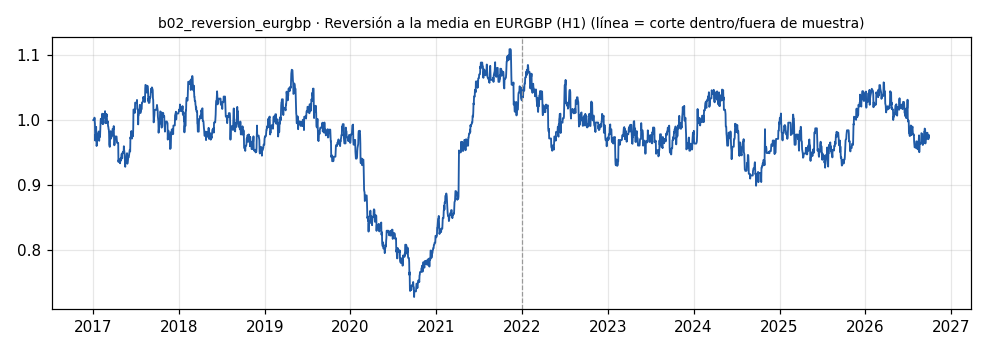

# b02_reversion_eurgbp · Reversión a la media en EURGBP (H1)

> **Veredicto v1: REPROBADO v1** — prototipo de investigación, no es una recomendación ni un sistema para dinero real.

**Concepto.** Euro y libra son economías muy atadas: el par oscila en rango. Comprar en el extremo bajo y vender en el alto esperando el regreso al promedio. Gana seguido y poco; pierde raro pero fuerte si cambia el régimen.

**Regla v1.** Z-score del cierre H1 contra su media y desviación de 100 velas. Largo si z < -2, corto si z > 2. Sale cuando |z| < 0,25, a las 72 velas (3 días) o con stop de 3 ATR(14). Riesgo 1 % por operación.

**Para quién.** Cuentas pequeñas en Latinoamérica con CFD desde 500-1.000 USD (spread bajo, stops moderados). En EE. UU., con un broker de forex regulado.

**Datos e instrumento.** MT5 Exness EURGBP H1 (velas BID + spread real desde 2024-04-16) · Periodo 2017-01-01 → 2026-09-29

**Potencial (según la sesión 20).** Alto como complemento: tiende a ganar justo cuando el trend following pierde en mercados laterales. Es el socio número uno de seguir la tendencia del oro.

## Backtest

| Métrica | Dentro de muestra | Fuera de muestra | Total |
|---|---|---|---|
| Sharpe | 0.13 | -0.06 | 0.04 |
| CAGR | 1.0 % | -1.6 % | -0.3 % |
| Drawdown máx. | -32.4 % | -17.1 % | -32.4 % |
| Operaciones | 606 | 574 | 1180 |
| Win rate | 46.0 % | 48.3 % | 47.1 % |
| Profit factor | 1.03 | 0.99 | 1.01 |

Placebo (100 corridas): mediana Sharpe -0.70, la señal supera al **100 %**.

Sin el mejor 3 % de las operaciones, la suma de retornos queda en -88.7 % (total 5.2 %).

**Controles:**
- ❌ Sharpe dentro de muestra > 0,3
- ❌ Sharpe fuera de muestra > 0,3
- ✅ supera al 95 % de los placebos
- ✅ ≥ 80 operaciones
- ❌ sigue positivo sin el mejor 3 %

## Notas y trampas conocidas
- Cambio de régimen: el Brexit (2016) es justo el tipo de evento que rompe un par 'de vecinos'; los datos arrancan en 2017, así que el backtest no ve ese golpe.
- Swap no modelado (posiciones de hasta 3 días).
- Spread anterior a 2024-04-16 modelado con la mediana (el terminal guarda 0).

## Siguiente paso sugerido
Medir su correlación diaria contra b01; probar filtro de régimen (volatilidad o pendiente de la media larga) que apague el bot cuando el par se pone en tendencia.
