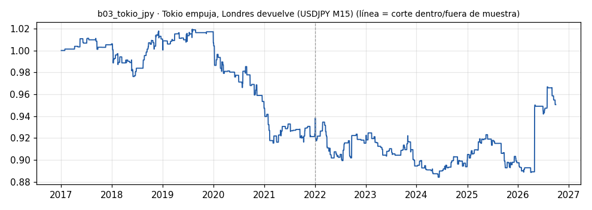

# b03_tokio_jpy · Tokio empuja, Londres devuelve (USDJPY M15)

> **Veredicto v1: DÉBIL** — prototipo de investigación, no es una recomendación ni un sistema para dinero real.

**Concepto.** Los movimientos del yen en la sesión asiática tienden a revertirse al abrir Europa. El bot opera en contra del empuje de Tokio cuando entra Londres.

**Regla v1.** Movimiento asiático = cierre 06:45 − apertura 00:00 UTC. Si supera 0,5 ATR diario (14 días, del día anterior), a las 07:00 UTC entra en contra. Sale a las 12:00 UTC o con stop de 8 ATR(14) M15. Riesgo 1 %.

**Para quién.** Cuentas pequeñas con CFD en Latinoamérica, con VPS: la sesión cae de noche en América y el bot opera mientras duermes.

**Datos e instrumento.** MT5 Exness USDJPY M15 (hora del servidor = UTC; velas BID + spread real desde 2024-04-16) · Periodo 2017-01-01 → 2026-09-29

**Potencial (según la sesión 20).** Medio. Las anomalías de horario son estrechas, se degradan y las intervenciones del Banco de Japón pueden romperlas. A cambio, es muy poco correlacionado con el oro.

## Backtest

| Métrica | Dentro de muestra | Fuera de muestra | Total |
|---|---|---|---|
| Sharpe | -0.52 | 0.15 | -0.12 |
| CAGR | -1.6 % | 0.6 % | -0.5 % |
| Drawdown máx. | -10.2 % | -5.8 % | -13.3 % |
| Operaciones | 178 | 194 | 372 |
| Win rate | 53.4 % | 45.9 % | 49.5 % |
| Profit factor | 0.77 | 1.10 | 0.93 |

Placebo (100 corridas): mediana Sharpe -0.13, la señal supera al **54 %**.

Sin el mejor 3 % de las operaciones, la suma de retornos queda en -23.3 % (total -4.5 %).

**Controles:**
- ❌ Sharpe dentro de muestra > 0,3
- ❌ Sharpe fuera de muestra > 0,3
- ❌ supera al 95 % de los placebos
- ✅ ≥ 80 operaciones
- ❌ sigue positivo sin el mejor 3 %

## Notas y trampas conocidas
- Versión genérica: el caso del fixing de Tokio (09:55 JST, días gotobi) vive en el repo tokio-reversal-caso con su propia auditoría; este v1 no distingue días gotobi.
- Horario fijo en UTC: Londres abre a las 07:00 UTC en verano y 08:00 UTC en invierno; el v1 no ajusta el horario de verano británico.
- Spread anterior a 2024-04-16 modelado con la mediana; el spread asiático real suele ser más ancho.

## Siguiente paso sugerido
Cruzar con el caso del fixing gotobi (repo tokio-reversal-caso) y separar días gotobi / no gotobi.
