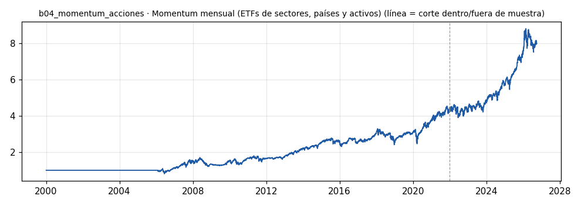

# b04_momentum_acciones · Momentum mensual (ETFs de sectores, países y activos)

> **Veredicto v1: CANDIDATO A FORWARD** — prototipo de investigación, no es una recomendación ni un sistema para dinero real.

**Concepto.** Lo que viene subiendo tiende a seguir subiendo: cada mes se compran los activos más fuertes de los últimos 6-12 meses y se rotan los que se quedan atrás.

**Regla v1.** Último día hábil de cada mes: retorno 12-1 (de hace 252 a hace 21 sesiones) de 20 ETFs; se compran los 4 mejores a pesos iguales (solo si su 12-1 es positivo; si no, ese hueco queda en efectivo) y se mantienen un mes. Costo 5 pb por lado sobre el giro.

**Para quién.** Inversionistas con Interactive Brokers desde ~5.000 USD (más fácil con acciones o ETFs fraccionados). Sirve desde cualquier país.

**Datos e instrumento.** yfinance, cierres diarios ajustados de ETFs (sectores SPDR, países y activos) · Periodo 2000-01-03 → 2026-09-29

**Potencial (según la sesión 20).** Medio-alto a largo plazo, bajo en semanas: opera una vez al mes, juntar 80 operaciones toma tiempo, depende del mercado general y sufre caídas bruscas cuando el momentum se voltea.

## Backtest

| Métrica | Dentro de muestra | Fuera de muestra | Total |
|---|---|---|---|
| Sharpe | 0.50 | 0.84 | 0.57 |
| CAGR | 7.0 % | 13.5 % | 8.1 % |
| Drawdown máx. | -28.9 % | -15.7 % | -28.9 % |
| Operaciones | 183 | 56 | 239 |
| Win rate | 61.2 % | 57.1 % | 60.3 % |
| Profit factor | 2.86 | 3.94 | 3.13 |

Placebo (100 corridas): mediana Sharpe 0.44, la señal supera al **97 %**.

Sin el mejor 3 % de las operaciones, la suma de retornos queda en 518.4 % (total 913.0 %).

**Controles:**
- ✅ Sharpe dentro de muestra > 0,3
- ✅ Sharpe fuera de muestra > 0,3
- ✅ supera al 95 % de los placebos
- ✅ ≥ 80 operaciones
- ✅ sigue positivo sin el mejor 3 %

## Notas y trampas conocidas
- Universo de ETFs para evitar sesgo de supervivencia: con acciones individuales tomadas de la lista de HOY el backtest saldría inflado (las que quebraron no están).
- El universo lo elegí a mano en 2026: sigue habiendo un sesgo de selección leve (sé qué ETFs existen hoy). XLRE (2015) y XLC (2018) entran al universo cuando tienen 12 meses de historia.
- Placebo: la misma rotación mensual eligiendo 4 ETFs al azar entre los disponibles.
- Operaciones = tramos continuos de tenencia por ETF (un ETF que se queda 3 meses cuenta como una).

## Siguiente paso sugerido
Pasarlo a acciones individuales con un universo point-in-time (sin supervivencia) y medir su correlación contra b01; probar el filtro de tendencia 1h/4h/1d de la tabla de la sesión.
