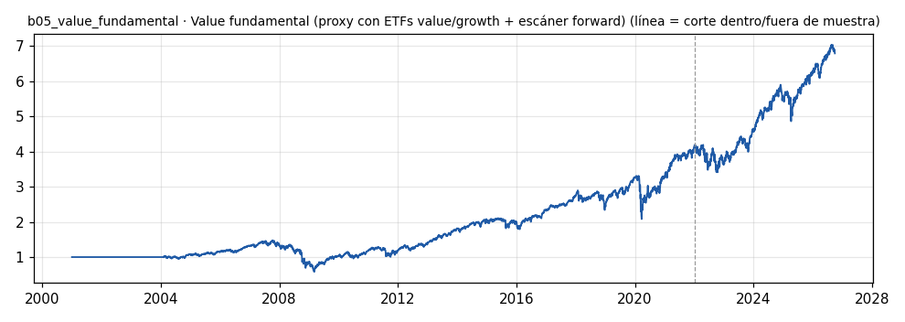

# b05_value_fundamental · Value fundamental (proxy con ETFs value/growth + escáner forward)

> **Veredicto v1: MUESTRA INSUFICIENTE** — prototipo de investigación, no es una recomendación ni un sistema para dinero real.

**Concepto.** Comprar negocios buenos cuando están baratos: empresas que crean valor (rentabilidad alta) y cotizan con descuento frente a sus pares.

**Regla v1.** PROXY, no el escáner: cada fin de mes, si la razón IVE/IVW (S&P 500 Value / Growth) está por debajo de su mediana de 3 años (value relativamente barato), se tiene IVE; si no, SPY. Costo 5 pb por lado. El escáner real (`escanear`) filtra ROE > 15 %, margen > 10 % y PER y EV/EBITDA por debajo de la mediana del universo.

**Para quién.** Inversionista paciente, con horizonte de años y cualquier capital.

**Datos e instrumento.** yfinance: IVE, IVW, SPY diarios (proxy); fundamentales actuales vía yfinance .info (escáner) · Periodo 2001-01-02 → 2026-09-29

**Potencial (según la sesión 20).** Bajo para encontrarlo en semanas: el edge se mide en años. Aun así aporta descorrelación frente a los bots de trading, y Profeta ya tiene los datos y se pueden abrir por MCP.

## Backtest

| Métrica | Dentro de muestra | Fuera de muestra | Total |
|---|---|---|---|
| Sharpe | 0.46 | 0.77 | 0.51 |
| CAGR | 7.0 % | 11.1 % | 7.7 % |
| Drawdown máx. | -60.3 % | -18.6 % | -60.3 % |
| Operaciones | 9 | 5 | 14 |
| Win rate | 77.8 % | 100.0 % | 85.7 % |
| Profit factor | 9.23 | inf | 18.83 |

Placebo (100 corridas): mediana Sharpe 0.52, la señal supera al **42 %**.

Sin el mejor 3 % de las operaciones, la suma de retornos queda en 166.7 % (total 226.5 %).

**Controles:**
- ✅ Sharpe dentro de muestra > 0,3
- ✅ Sharpe fuera de muestra > 0,3
- ❌ supera al 95 % de los placebos
- ❌ ≥ 80 operaciones
- ✅ sigue positivo sin el mejor 3 %

## Notas y trampas conocidas
- ES UN PROXY: mide si inclinarse a value cuando está barato frente a growth pagó. No valida el escáner de empresas individuales (para eso hacen falta fundamentales point-in-time).
- Está casi siempre invertido en renta variable EE. UU.: su correlación con el S&P 500 es alta, no con b01.
- Placebo: misma proporción de meses en IVE, pero elegidos al azar.
- Los fundamentales de yfinance .info son de HOY; usarlos en el pasado sería mirar el futuro.

## Siguiente paso sugerido
Correr `escanear()` cada mes sobre el universo de Profeta y guardar la foto (fecha, métricas, precio) para construir el dataset point-in-time propio; en 12-24 meses ya hay backtest honesto.
