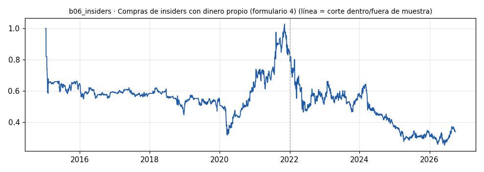

# b06_insiders · Compras de insiders con dinero propio (formulario 4)

> **Veredicto v1: REPROBADO v1** — prototipo de investigación, no es una recomendación ni un sistema para dinero real.

**Concepto.** Seguir al directivo que compra acciones de su empresa con su propio dinero: suele saber algo. Las ventas no se siguen (impuestos, planes programados).

**Regla v1.** Compras (código P) >= 500.000 USD de directivos (sin los que solo son accionistas del 10 %); las 5 más grandes de cada mes. Largo al cierre de la primera sesión después del filing, salida a las 20 sesiones. Cada posición pesa 1/max(abiertas, 5); costo 10 pb por lado.

**Para quién.** Cuentas de acciones en Interactive Brokers desde 2.000-5.000 USD, desde EE. UU. o Latinoamérica.

**Datos e instrumento.** openinsider.com (formularios 4 de la SEC) + precios diarios yfinance · Periodo 2015-01-08 → 2026-09-29

**Potencial (según la sesión 20).** Alto dentro de la comunidad: la señal ya está procesada en Profeta, casi ningún retail hispano la usa y cuesta poco convertirla en bot. Límite: las compras relevantes son pocas y la muestra crece lento.

## Backtest

| Métrica | Dentro de muestra | Fuera de muestra | Total |
|---|---|---|---|
| Sharpe | 0.04 | -0.41 | -0.17 |
| CAGR | -2.4 % | -17.5 % | -8.8 % |
| Drawdown máx. | -67.9 % | -70.0 % | -75.2 % |
| Operaciones | 210 | 242 | 452 |
| Win rate | 50.0 % | 43.4 % | 46.5 % |
| Profit factor | 1.05 | 0.83 | 0.91 |

Placebo (100 corridas): mediana Sharpe 0.07, la señal supera al **19 %**.

Sin el mejor 3 % de las operaciones, la suma de retornos queda en -1,079.2 % (total -245.6 %).

**Controles:**
- ❌ Sharpe dentro de muestra > 0,3
- ❌ Sharpe fuera de muestra > 0,3
- ❌ supera al 95 % de los placebos
- ✅ ≥ 80 operaciones
- ❌ sigue positivo sin el mejor 3 %

## Notas y trampas conocidas
- Sesgo de supervivencia: yfinance no tiene precio de muchas empresas deslistadas; los eventos sin precio se descartan, y suelen ser los peores.
- openinsider publica la hora del filing; se entra al cierre de la PRIMERA sesión posterior a la fecha del filing (sin mirar el futuro, pero se pierde parte de la reacción del día).
- Días sin posiciones abiertas cuentan como 0 % (efectivo).
- Placebo: los mismos tickers con la fecha de entrada desplazada ±20-250 sesiones al azar.
- Tamaño: 5 cupos (cada compra pesa 1/5 de la cuenta, o menos si hay más de 5 abiertas).
- Eventos: 705 compras (top 5/mes); tickers con precio: 286/451.

## Siguiente paso sugerido
Pasar la fuente a Profeta (que ya separa compras con dinero propio de compensación y mide el % de la posición) y probar el filtro 'amplía > 10 % su posición' y las compras en grupo (cluster buys).
