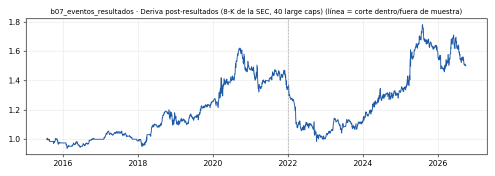

# b07_eventos_resultados · Deriva post-resultados (8-K de la SEC, 40 large caps)

> **Veredicto v1: DÉBIL** — prototipo de investigación, no es una recomendación ni un sistema para dinero real.

**Concepto.** Operar la reacción a los resultados: el retail no gana la carrera de los primeros segundos, pero sí puede capturar la deriva de los días siguientes.

**Regla v1.** Día de reacción = sesión en la que el mercado ve el 8-K 2.02 (si se publicó tras las 16:00 de Nueva York, la sesión siguiente). Si ese día el precio sube > 3 %, largo al cierre; si cae > 3 %, corto. Salida a las 20 sesiones. Cada posición pesa 1/max(abiertas, 3); costo 10 pb por lado.

**Para quién.** Perfil intermedio-avanzado con datos confiables, sin importar el país.

**Datos e instrumento.** SEC EDGAR (fechas y hora de los 8-K ítem 2.02) + precios diarios yfinance · Periodo 2015-07-24 → 2026-09-29

**Potencial (según la sesión 20).** Medio. Aquí un agente de lenguaje brilla porque lee y clasifica la noticia, pero el costo en tokens y la latencia pesan más que en cualquier otra idea.

## Backtest

| Métrica | Dentro de muestra | Fuera de muestra | Total |
|---|---|---|---|
| Sharpe | 0.49 | 0.22 | 0.36 |
| CAGR | 4.8 % | 2.2 % | 3.7 % |
| Drawdown máx. | -18.5 % | -28.3 % | -39.4 % |
| Operaciones | 196 | 366 | 562 |
| Win rate | 54.6 % | 49.5 % | 51.2 % |
| Profit factor | 1.27 | 1.08 | 1.14 |

Placebo (100 corridas): mediana Sharpe -0.29, la señal supera al **99 %**.

Sin el mejor 3 % de las operaciones, la suma de retornos queda en -181.0 % (total 229.5 %).

**Controles:**
- ✅ Sharpe dentro de muestra > 0,3
- ❌ Sharpe fuera de muestra > 0,3
- ✅ supera al 95 % de los placebos
- ✅ ≥ 80 operaciones
- ❌ sigue positivo sin el mejor 3 %

## Notas y trampas conocidas
- Tamaño: 3 cupos (cada posición pesa 1/max(abiertas, 3)).
- Proxy de sorpresa = reacción del precio del día (no el consenso de analistas): la regla compra lo que ya subió; no es el PEAD clásico por sorpresa de BPA.
- Universo de 40 large caps elegidas HOY: sesgo de supervivencia fuerte (son las ganadoras de la década).
- El historial 'recent' de la SEC trae ~1.000 filings por empresa; hay 8-K 2.02 de 1100 anuncios, 562 superan ±3%.
- Días sin posiciones abiertas = 0 % (efectivo). Placebo: mismas acciones, fecha desplazada al azar.
- El buscador de EDGAR no resolvió el CIK de GOOGL, JPM, BAC, ORCL y GS: quedan fuera (35 de 40).

## Siguiente paso sugerido
Sustituir el proxy por la sorpresa real (consenso vs. reportado) y dejar que un agente clasifique el tono de la guía; medir si esa capa añade algo sobre la reacción de precio.
