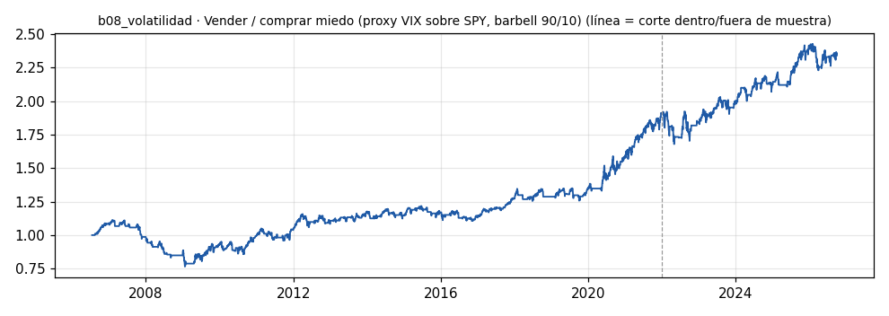

# b08_volatilidad · Vender / comprar miedo (proxy VIX sobre SPY, barbell 90/10)

> **Veredicto v1: DÉBIL** — prototipo de investigación, no es una recomendación ni un sistema para dinero real.

**Concepto.** Comparar la volatilidad que descuentan las opciones con la que realmente ocurre. Pata 90 %: cobrar la prima del miedo cuando está cara. Pata 10 %: comprar protección barata antes de la tormenta.

**Regla v1.** PROXY. Pata 'vender prima' (90 %): largo SPY mientras VIX − volatilidad realizada 20d del SPY > 3 puntos y VIX < VIX3M (curva en contango). Pata 'comprar miedo' (10 %): corto SPY 10 sesiones cuando el VIX está por debajo de su percentil 20 de un año y cruza por encima de su media de 10 días. Costo 5 pb por lado.

**Para quién.** Cuentas con opciones en Interactive Brokers desde 5.000-10.000 USD, siempre con spreads de riesgo definido y nunca vendiendo opciones descubiertas.

**Datos e instrumento.** yfinance: ^VIX, ^VIX3M, SPY diarios · Periodo 2006-07-17 → 2026-09-29

**Potencial (según la sesión 20).** Medio. Impulse Detector ya trae el contexto de opciones (la materia prima existe) y la volatilidad comprada es la mejor candidata para el 10 % del barbell de Taleb.

## Backtest

| Métrica | Dentro de muestra | Fuera de muestra | Total |
|---|---|---|---|
| Sharpe | 0.49 | 0.49 | 0.49 |
| CAGR | 4.3 % | 4.4 % | 4.3 % |
| Drawdown máx. | -31.3 % | -12.6 % | -31.3 % |
| Operaciones | 259 | 104 | 363 |
| Win rate | 56.4 % | 59.6 % | 57.3 % |
| Profit factor | 1.22 | 1.13 | 1.19 |

Placebo (100 corridas): mediana Sharpe 0.35, la señal supera al **77 %**.

Sin el mejor 3 % de las operaciones, la suma de retornos queda en -17.3 % (total 58.9 %).

**Controles:**
- ✅ Sharpe dentro de muestra > 0,3
- ✅ Sharpe fuera de muestra > 0,3
- ❌ supera al 95 % de los placebos
- ✅ ≥ 80 operaciones
- ❌ sigue positivo sin el mejor 3 %

## Notas y trampas conocidas
- VIX al cierre (16:15 NY) vs SPY al cierre (16:00): 15 min de desfase, sin efecto práctico en diario.
- ES UN PROXY: la pata de prima vendida se expresa como largo SPY, no como venta de opciones; el perfil de cola real de vender puts/spreads es peor que el de este proxy.
- Pata miedo: 120 disparos en todo el periodo (muestra pequeña).
- Operaciones = las de las dos patas juntas; su 'ret' no está ponderado por el 90/10.
- Placebo: cada pata con su posición desplazada en el tiempo al azar.

## Siguiente paso sugerido
Montar la niñera de IBKR (agentes/ninera_ibkr.py) para registrar la implícita real por vencimiento y rehacer el disparador con la cadena, no con el VIX.
