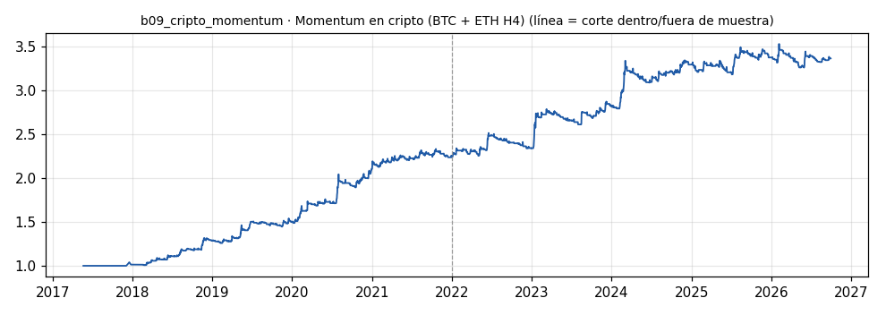

# b09_cripto_momentum · Momentum en cripto (BTC + ETH H4)

> **Veredicto v1: CANDIDATO A FORWARD** — prototipo de investigación, no es una recomendación ni un sistema para dinero real.

**Concepto.** Tendencia en un mercado 24/7: entrar cuando BTC o ETH rompen su rango con la tendencia de fondo a favor y dejar correr con trailing stop. Pocas ganadoras muy grandes pagan muchas pérdidas pequeñas.

**Regla v1.** Velas H4. Largo si el cierre rompe el máximo de las últimas 30 velas (5 días) con la EMA de 300 velas (~50 días) subiendo; corto al revés. Stop inicial 2,5 ATR(14), trailing 4 ATR. Riesgo 1 % por operación. Cartera 50/50 BTC y ETH.

**Para quién.** Cualquiera, desde cualquier país con acceso a cripto, incluso con 250 USD por la volatilidad — pero solo con el capital que se pueda perder.

**Datos e instrumento.** MT5 Exness BTCUSD y ETHUSD H4 (velas BID + spread real desde 2024-04-16) · Periodo 2017-05-22 → 2026-09-29

**Potencial (según la sesión 20).** Alto en retorno y alto en ruina. Encaja en el 10 % especulativo, no en el 90 %. En crisis tiende a correlacionarse con los otros bots de tendencia.

## Backtest

| Métrica | Dentro de muestra | Fuera de muestra | Total |
|---|---|---|---|
| Sharpe | 1.91 | 1.04 | 1.48 |
| CAGR | 19.3 % | 8.8 % | 13.8 % |
| Drawdown máx. | -7.4 % | -7.7 % | -7.7 % |
| Operaciones | 211 | 265 | 476 |
| Win rate | 42.7 % | 34.3 % | 38.0 % |
| Profit factor | 2.79 | 1.67 | 2.15 |

Placebo (100 corridas): mediana Sharpe 1.06, la señal supera al **99 %**.

Sin el mejor 3 % de las operaciones, la suma de retornos queda en 87.3 % (total 250.8 %).

**Controles:**
- ✅ Sharpe dentro de muestra > 0,3
- ✅ Sharpe fuera de muestra > 0,3
- ✅ supera al 95 % de los placebos
- ✅ ≥ 80 operaciones
- ✅ sigue positivo sin el mejor 3 %

## Notas y trampas conocidas
- Contexto de la sesión 20 (NO es resultado de este bot): el caso azar hizo +434 % en 72 días con un drawdown del 64 %. Ese es el perfil de riesgo de la familia.
- Swap/financiación de los CFD cripto no modelado: en posiciones de varios días resta.
- Spread anterior a 2024-04-16 modelado con la mediana (el terminal guarda 0).
- ETH empieza en 2018-02; antes de esa fecha la pata ETH suma 0 (la cartera va al 50 % invertida).
- En crisis la correlación con b01 y otros bots de tendencia sube: medirla en los peores días.
- ANTES de creerse el veredicto: el laboratorio BTC del proyecto ORO (18 familias, arnés con comisión Raw 3,5 USD/lote/lado y slippage 0,05 % en cada fill) encontró que en su mejor candidato el placebo ganaba más que la señal. Este v1 corre sin comisión ni slippage extra: repetirlo en ese arnés es el siguiente paso.

## Siguiente paso sugerido
Medir su correlación con b01 en días de tormenta (no solo la media) antes de sumarlo a la cartera.
