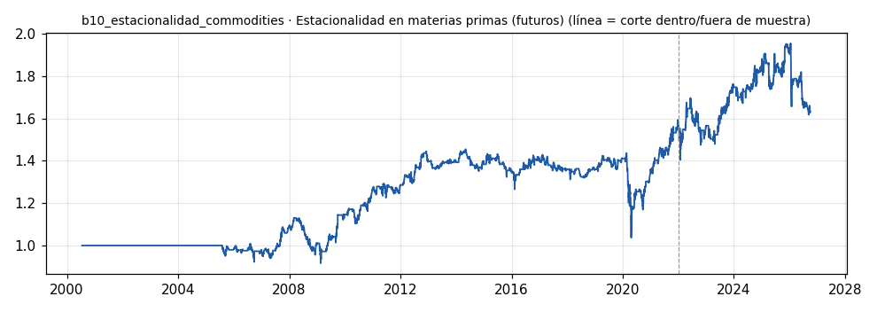

# b10_estacionalidad_commodities · Estacionalidad en materias primas (futuros)

> **Veredicto v1: DÉBIL** — prototipo de investigación, no es una recomendación ni un sistema para dinero real.

**Concepto.** Aprovechar patrones de temporada: el gas natural antes del invierno, los granos en siembra y cosecha, la gasolina de calefacción. El calendario es la señal.

**Regla v1.** Para cada futuro y cada mes: media y t-estadístico del retorno de ese mes del calendario en TODOS los años anteriores (mínimo 5). Largo el mes completo si t > 1,5; corto si t < -1,5. Cartera equiponderada de NG, CL, HO, ZC, ZW, ZS.

**Para quién.** Microfuturos en EE. UU. y CFD de materias primas en Latinoamérica.

**Datos e instrumento.** yfinance futuros continuos diarios NG=F, CL=F, HO=F, ZC=F, ZW=F, ZS=F · Periodo 2000-07-17 → 2026-09-29

**Potencial (según la sesión 20).** Bajo a medio. Muy descorrelacionado, pero son pocas operaciones al año: validar 80 tomaría años. Sirve más como filtro para otros bots que como aporte propio.

## Backtest

| Métrica | Dentro de muestra | Fuera de muestra | Total |
|---|---|---|---|
| Sharpe | 0.32 | 0.13 | 0.26 |
| CAGR | 2.1 % | 0.9 % | 1.9 % |
| Drawdown máx. | -28.7 % | -17.2 % | -28.7 % |
| Operaciones | 214 | 93 | 307 |
| Win rate | 50.5 % | 53.8 % | 51.5 % |
| Profit factor | 1.43 | 1.06 | 1.30 |

Placebo (100 corridas): mediana Sharpe 0.21, la señal supera al **62 %**.

Sin el mejor 3 % de las operaciones, la suma de retornos queda en -1.5 % (total 310.3 %).

**Controles:**
- ✅ Sharpe dentro de muestra > 0,3
- ❌ Sharpe fuera de muestra > 0,3
- ❌ supera al 95 % de los placebos
- ✅ ≥ 80 operaciones
- ❌ sigue positivo sin el mejor 3 %

## Notas y trampas conocidas
- TRAMPA: los futuros continuos de yfinance empalman contratos sin ajustar; cada roll mete un salto de precio que no es retorno real (sobre todo en NG y CL con contango fuerte).
- Se descartan cierres <= 0 (el crudo cotizó negativo en abr-2020).
- Pocas operaciones por año y por mercado: el t-estadístico con 5-20 años es frágil y hay 72 celdas mes×mercado probadas a la vez (múltiples comparaciones).
- Costo 5 pb por lado; no incluye roll ni margen de futuros.

## Siguiente paso sugerido
Usarlo como filtro (no operar en contra de la temporada) sobre un bot de tendencia en gas o crudo.
