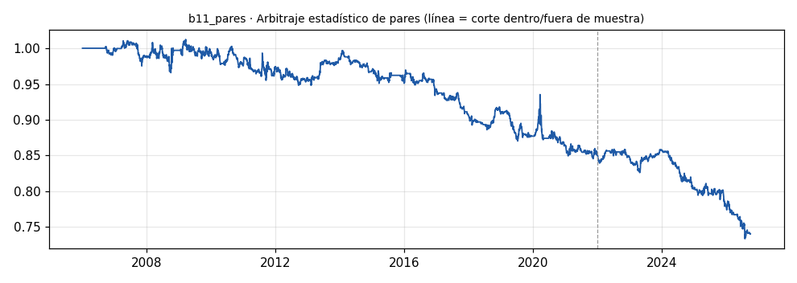

# b11_pares · Arbitraje estadístico de pares

> **Veredicto v1: REPROBADO v1** — prototipo de investigación, no es una recomendación ni un sistema para dinero real.

**Concepto.** Dos gemelos (oro y plata, Coca-Cola y Pepsi...) que se separan tienden a volver a juntarse: comprar el rezagado y vender el adelantado, neutral al mercado.

**Regla v1.** Beta por regresión rodante de 120 días entre log-precios (solo datos pasados). Diferencial = logA - beta·logB; z-score de 60 días. Entra si |z| > 2 (largo el barato, corto el caro), sale cuando z cruza 0, stop si |z| > 4 o a los 30 días. Pares: GLD/SLV, KO/PEP, XOM/CVX, EWA/EWC.

**Para quién.** Desde 5.000 USD en Interactive Brokers con ventas en corto, o cuentas pequeñas con CFD en Latinoamérica que permitan operar ambos lados.

**Datos e instrumento.** yfinance diarios ajustados GLD, SLV, KO, PEP, XOM, CVX, EWA, EWC · Periodo 2006-01-03 → 2026-09-29

**Potencial (según la sesión 20).** Medio-alto como descorrelacionador. Ideal para la fábrica de bots (la IA puede escanear cientos de pares). El riesgo: que la relación entre los gemelos se rompa para siempre.

## Backtest

| Métrica | Dentro de muestra | Fuera de muestra | Total |
|---|---|---|---|
| Sharpe | -0.33 | -0.96 | -0.48 |
| CAGR | -1.0 % | -2.9 % | -1.4 % |
| Drawdown máx. | -16.5 % | -14.6 % | -27.5 % |
| Operaciones | 234 | 76 | 310 |
| Win rate | 42.7 % | 42.1 % | 42.6 % |
| Profit factor | 0.80 | 0.50 | 0.71 |

Placebo (100 corridas): mediana Sharpe -0.16, la señal supera al **4 %**.

Sin el mejor 3 % de las operaciones, la suma de retornos queda en -160.4 % (total -100.9 %).

**Controles:**
- ❌ Sharpe dentro de muestra > 0,3
- ❌ Sharpe fuera de muestra > 0,3
- ❌ supera al 95 % de los placebos
- ✅ ≥ 80 operaciones
- ❌ sigue positivo sin el mejor 3 %

## Notas y trampas conocidas
- Costo del corto (préstamo de acciones) no modelado; en ETFs líquidos suele ser bajo, en pares exóticos no.
- Beta variable día a día: el rebalanceo diario de la cobertura real costaría algo más que lo modelado.
- Los pares se eligieron a mano por intuición económica, no por escaneo; aun así hay sesgo de supervivencia (sabemos hoy que siguen existiendo y relacionados).
- Riesgo de ruptura de régimen: si la relación se rompe, el stop a |z| > 4 corta pero no evita la pérdida.

## Siguiente paso sugerido
Escanear pares con la fábrica y exigir que sobrevivan fuera de muestra con corrección por múltiples pruebas.
