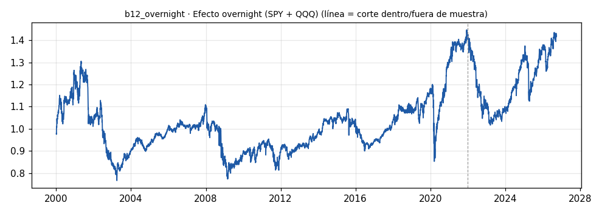

# b12_overnight · Efecto overnight (SPY + QQQ)

> **Veredicto v1: DÉBIL** — prototipo de investigación, no es una recomendación ni un sistema para dinero real.

**Concepto.** La bolsa gana de noche: comprar al cierre y vender en la apertura del día siguiente, sin exposición durante la sesión.

**Regla v1.** Cada día hábil: compra al cierre, vende en la apertura siguiente. Cartera 50/50 SPY y QQQ. Costo 1,5 pb por lado (dos lados por noche).

**Para quién.** EE. UU. con ETF de índices o micro y nano futuros, desde capital pequeño.

**Datos e instrumento.** yfinance diarios SPY y QQQ (open y close ajustados) · Periodo 2000-01-04 → 2026-09-29

**Potencial (según la sesión 20).** Medio. Es el caso de estudio perfecto de cambio de régimen: con el Nasdaq 23x5 desde diciembre de 2026, medir qué le pasa a este efecto antes y después será una contribución única de la comunidad.

## Backtest

| Métrica | Dentro de muestra | Fuera de muestra | Total |
|---|---|---|---|
| Sharpe | 0.19 | 0.06 | 0.17 |
| CAGR | 1.6 % | -0.0 % | 1.3 % |
| Drawdown máx. | -41.3 % | -28.7 % | -41.3 % |
| Operaciones | 5535 | 1189 | 6724 |
| Win rate | 53.1 % | 52.3 % | 53.0 % |
| Profit factor | 1.04 | 1.01 | 1.03 |

Placebo (100 corridas): mediana Sharpe -0.15, la señal supera al **98 %**.

Sin el mejor 3 % de las operaciones, la suma de retornos queda en -374.2 % (total 55.5 %).

**Controles:**
- ❌ Sharpe dentro de muestra > 0,3
- ❌ Sharpe fuera de muestra > 0,3
- ✅ supera al 95 % de los placebos
- ✅ ≥ 80 operaciones
- ❌ sigue positivo sin el mejor 3 %

## Notas y trampas conocidas
- Comparación bruta (sin costos), 50/50 SPY+QQQ: retorno anual medio de la noche 9.6 % vs intradía 1.2 %; Sharpe noche neto 0.17, intradía bruto 0.07, buy & hold 0.49.
- Cada noche cuenta como una operación: la muestra es enorme, pero están autocorrelacionadas por régimen.
- El costo decide todo: 2 lados por día. Con 5 pb por lado (acciones sueltas, CFD) el efecto desaparece.
- Los open de yfinance son la primera cotización oficial; ejecutar en la subasta de apertura/cierre (MOO/MOC) es lo que hace realista el costo modelado.
- Cambio de régimen: Nasdaq 23x5 aprobado desde el 6-dic-2026 (según la sesión 20). Medir antes/después.

## Siguiente paso sugerido
Congelar hoy la medición pre-régimen y repetirla mes a mes después del cambio de horario del Nasdaq.
