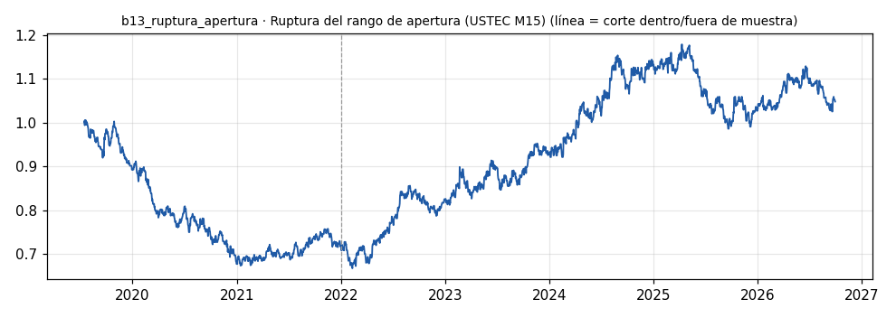

# b13_ruptura_apertura · Ruptura del rango de apertura (USTEC M15)

> **Veredicto v1: DÉBIL** — prototipo de investigación, no es una recomendación ni un sistema para dinero real.

**Concepto.** Operar rupturas de rango de corto plazo, como el rango de apertura de la sesión en índices.

**Regla v1.** Rango = máximo y mínimo de 9:30 a 10:00 de Nueva York (horario de verano respetado). Primera vela M15 que cierra fuera del rango antes de las 15:00 NY: entra a favor. Sale a las 15:45 NY o con stop de 4 ATR(14) M15. Una operación por día como máximo. Riesgo 1 %.

**Para quién.** Cuentas pequeñas con CFD en Latinoamérica o microfuturos (MNQ/MES) en EE. UU.

**Datos e instrumento.** MT5 Exness USTEC M15 (velas BID + spread real desde 2024-04-16) · Periodo 2019-07-16 → 2026-09-29

**Potencial (según la sesión 20).** Medio, con advertencia: muchas rupturas son falsas y la estrategia se parece bastante a la número 1; no aporta descorrelación si ya tienes el Runner.

## Backtest

| Métrica | Dentro de muestra | Fuera de muestra | Total |
|---|---|---|---|
| Sharpe | -0.94 | 0.61 | 0.10 |
| CAGR | -12.6 % | 8.3 % | 0.7 % |
| Drawdown máx. | -33.1 % | -16.3 % | -33.7 % |
| Operaciones | 606 | 1168 | 1774 |
| Win rate | 47.2 % | 51.0 % | 49.7 % |
| Profit factor | 0.84 | 1.12 | 1.02 |

Placebo (100 corridas): mediana Sharpe -0.12, la señal supera al **78 %**.

Sin el mejor 3 % de las operaciones, la suma de retornos queda en -114.8 % (total 10.5 %).

**Controles:**
- ❌ Sharpe dentro de muestra > 0,3
- ✅ Sharpe fuera de muestra > 0,3
- ❌ supera al 95 % de los placebos
- ✅ ≥ 80 operaciones
- ❌ sigue positivo sin el mejor 3 %

## Notas y trampas conocidas
- Stop por ATR en vez de 'al otro lado del rango': el motor v1 solo admite stops en múltiplos de ATR.
- Se parece al bot 01 (ruptura + tendencia): revisar la correlación antes de sumarlo a la cartera.
- Spread anterior a 2024-04-16 modelado con la mediana (el terminal guarda 0).

## Siguiente paso sugerido
Medir correlación contra b01 y probar filtro de volatilidad del rango (rangos estrechos vs anchos).
