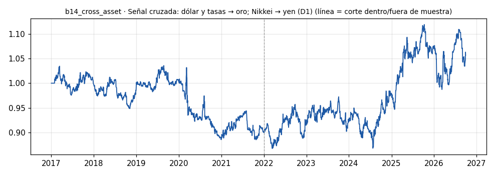

# b14_cross_asset · Señal cruzada: dólar y tasas → oro; Nikkei → yen (D1)

> **Veredicto v1: DÉBIL** — prototipo de investigación, no es una recomendación ni un sistema para dinero real.

**Concepto.** Usar la información de un activo para decidir en otro: tasas de bonos o el índice dólar para el oro, el Nikkei para el dólar frente al yen.

**Regla v1.** Pata oro (50 %): largo XAUUSD si el DXY y la tasa a 10 años (^TNX) cayeron en los últimos 20 días; corto si ambos subieron; fuera en otro caso. Pata yen (50 %): largo USDJPY si el Nikkei (^N225) subió en 20 días (apetito de riesgo), corto si bajó. Señales con datos del día anterior.

**Para quién.** Perfil intermedio, con cualquier capital y desde cualquier país (CFD o futuros).

**Datos e instrumento.** MT5 Exness XAUUSD y USDJPY D1 + yfinance DX-Y.NYB, ^TNX y ^N225 · Periodo 2017-01-02 → 2026-09-29

**Potencial (según la sesión 20).** Medio-alto. Es exactamente el trabajo de analista de la sesión; Impulse Detector ya lo hace al usar opciones para calibrar el stop del dólar frente al yen.

## Backtest

| Métrica | Dentro de muestra | Fuera de muestra | Total |
|---|---|---|---|
| Sharpe | -0.29 | 0.39 | 0.10 |
| CAGR | -2.1 % | 3.4 % | 0.6 % |
| Drawdown máx. | -14.6 % | -11.8 % | -16.3 % |
| Operaciones | 317 | 272 | 589 |
| Win rate | 46.1 % | 50.7 % | 48.2 % |
| Profit factor | 0.85 | 1.20 | 1.05 |

Placebo (100 corridas): mediana Sharpe -0.16, la señal supera al **81 %**.

Sin el mejor 3 % de las operaciones, la suma de retornos queda en -93.6 % (total 15.6 %).

**Controles:**
- ❌ Sharpe dentro de muestra > 0,3
- ✅ Sharpe fuera de muestra > 0,3
- ❌ supera al 95 % de los placebos
- ✅ ≥ 80 operaciones
- ❌ sigue positivo sin el mejor 3 %

## Notas y trampas conocidas
- Swap del oro aproximado (1,6 pb por noche al largo, 0 al corto); el swap de USDJPY no está modelado (el largo USDJPY suele COBRAR swap, así que la pata yen está subestimada en largos y sobreestimada en cortos).
- La tasa ^TNX de yfinance cierra en hora de EE. UU. y las velas D1 de MT5 a las 00:00 UTC: por eso todas las señales van desplazadas un día.
- Spread anterior a 2024-04-16 modelado con la mediana (el terminal guarda 0).
- Cada pata es una posición 0/±1 al 50 %: el riesgo no está normalizado por volatilidad.

## Siguiente paso sugerido
Sustituir la regla fija por un analista (agente) que pondere varias señales cruzadas; medir cada señal por separado antes de combinarlas.
