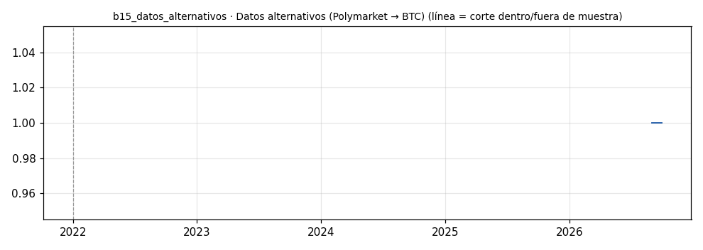

# b15_datos_alternativos · Datos alternativos (Polymarket → BTC)

> **Veredicto v1: MUESTRA INSUFICIENTE** — prototipo de investigación, no es una recomendación ni un sistema para dinero real.

**Concepto.** Usar fuentes poco exploradas — probabilidades de Polymarket, sentimiento en X, insiders en mercados de predicción — como disparador. Nadie compite ahí; por eso también puede ser puro ruido.

**Regla v1.** v1: registrar cada día las probabilidades de los mercados más líquidos de Polymarket (colector). Backtest mínimo si hay historial: si la probabilidad de un mercado cripto sube más de 5 puntos en 7 días, largo BTC los 5 días siguientes.

**Para quién.** Exploradores con capital pequeño, dentro del 10 % especulativo.

**Datos e instrumento.** API pública de Polymarket (gamma-api / clob prices-history) + yfinance BTC-USD. Grok (sentimiento en X) queda como fuente futura. · Periodo 2026-08-31 → 2026-09-29

**Potencial (según la sesión 20).** El de mayor varianza. Donde más posibilidad hay de un edge propio (nadie compite ahí) y donde más probable es que sea ruido. Terreno natural del bot desechable.

## Backtest

| Métrica | Dentro de muestra | Fuera de muestra | Total |
|---|---|---|---|
| Sharpe | — | — | — |
| CAGR | — | — | — |
| Drawdown máx. | — | — | — |
| Operaciones | 0 | 0 | 0 |
| Win rate | — | — | — |
| Profit factor | — | — | — |

Placebo: no aplica.

Sin el mejor 3 % de las operaciones, la suma de retornos queda en — (total —).

**Controles:**
- ❌ Sharpe dentro de muestra > 0,3
- ❌ Sharpe fuera de muestra > 0,3
- ❌ supera al 95 % de los placebos
- ❌ ≥ 80 operaciones
- ❌ sigue positivo sin el mejor 3 %

## Notas y trampas conocidas
- Sin muestra: primero se construye el dataset (niñera). La API de Polymarket no respondió desde esta máquina (ConnectionError); en Colombia el acceso suele estar bloqueado a nivel de red. Hay que correr el colector desde otra red/VPS.
- Grok (sentimiento en X) queda como segunda fuente para el colector.

## Siguiente paso sugerido
Dejar el colector corriendo (niñera) varias semanas y solo entonces formular hipótesis pre-registradas.
